# AWS 3-Tier Highly Available Web Application

## 🏗️ Architecture

### AWS 3-Tier Architecture Diagram

[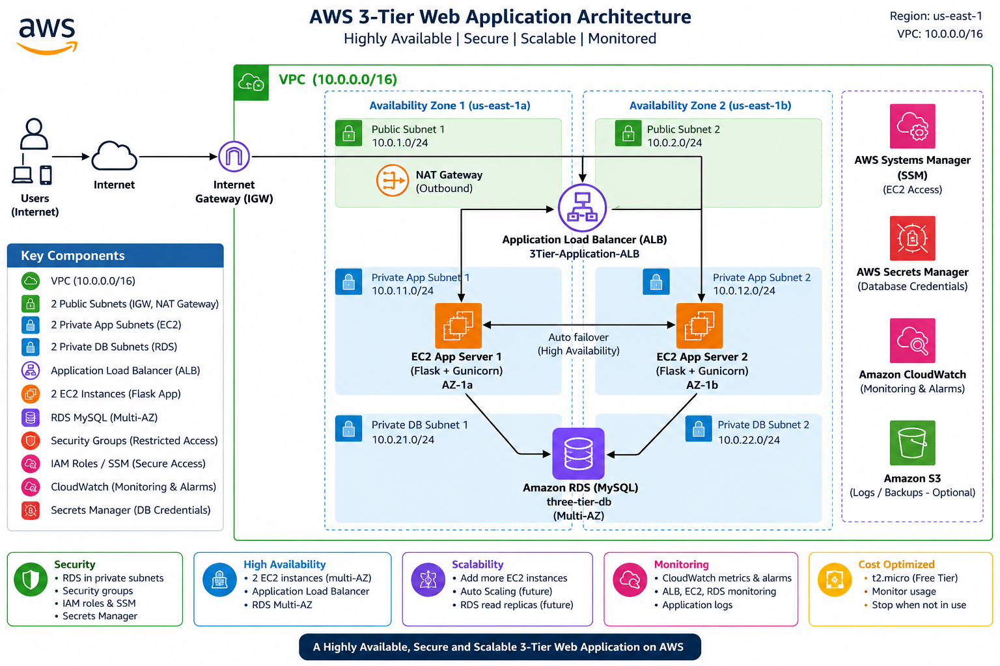](architecture/architecture-diagram.png)

## ☁️ AWS Infrastructure

### VPC
### Subnets
### Application Load Balancer
### EC2 Instances
### Amazon RDS

## 🔐 Security

## 🔑 AWS Secrets Manager

## 👤 IAM

## 📊 Amazon CloudWatch

## 🔄 High Availability Test

## 📸 Project Screenshots

### VPC Configuration

### Subnet Configuration
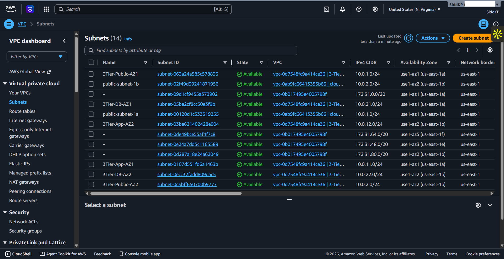

### Route Tables
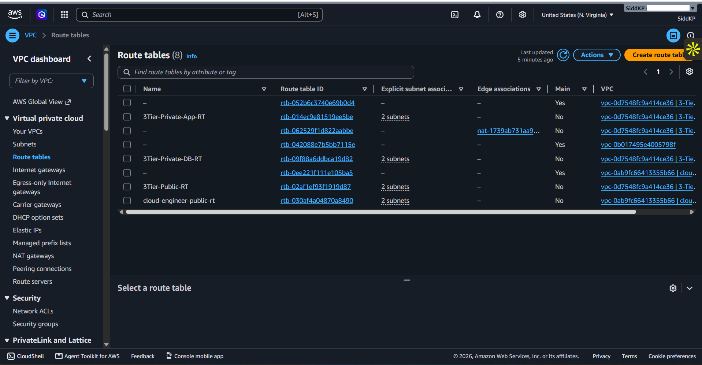

### ALB Security Group
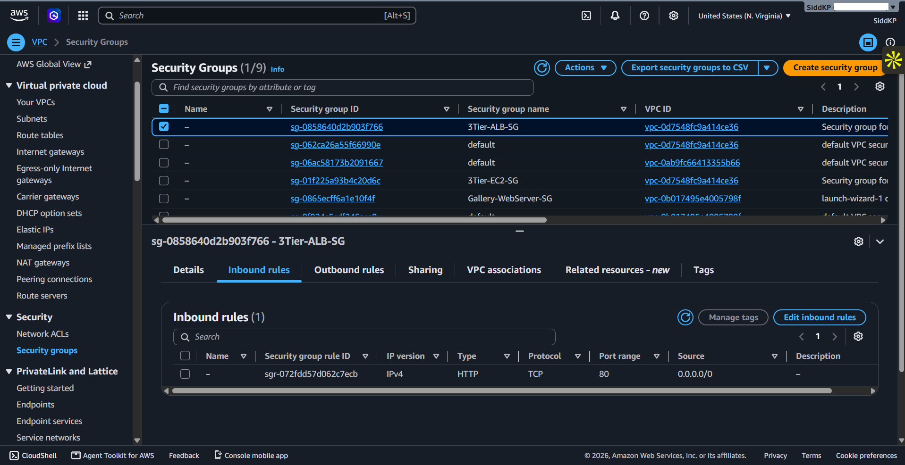

### EC2 Security Group
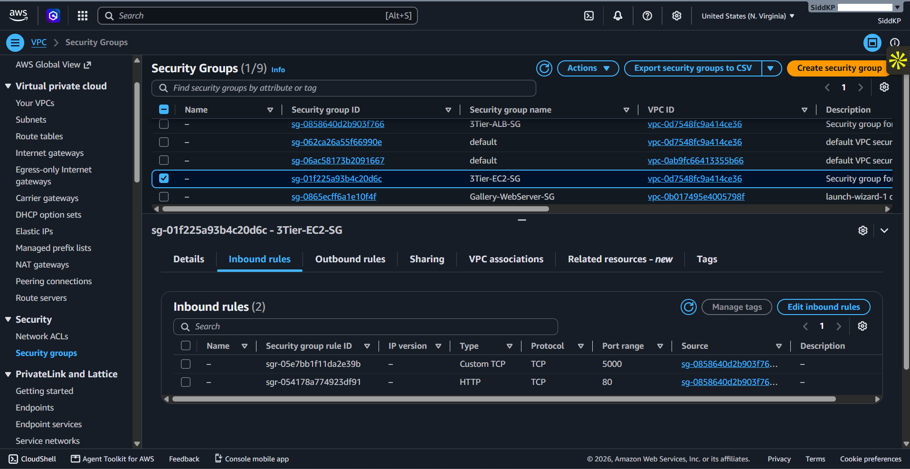

### RDS Security Group
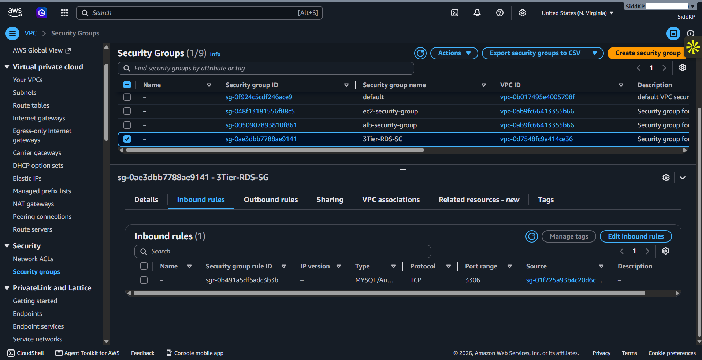

### EC2 Instances
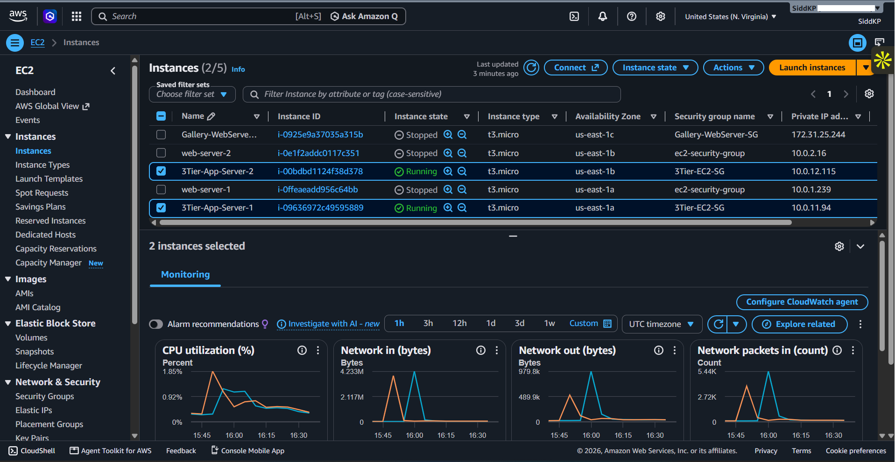

### Application Load Balancer
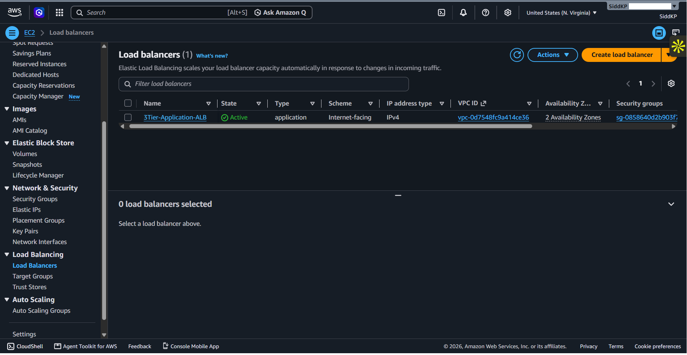

### Target Group
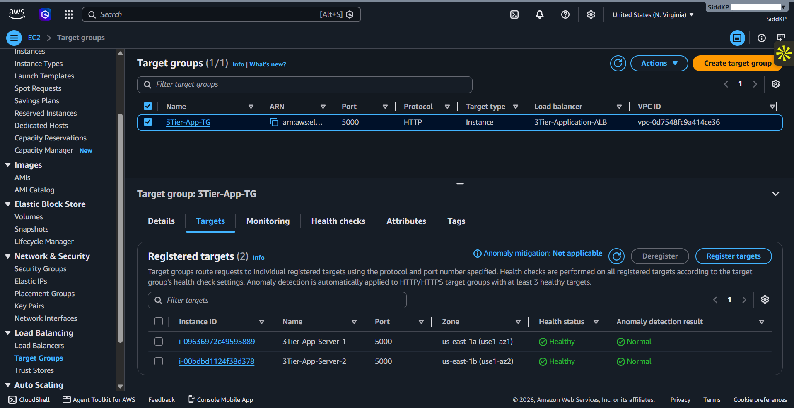

### Amazon RDS
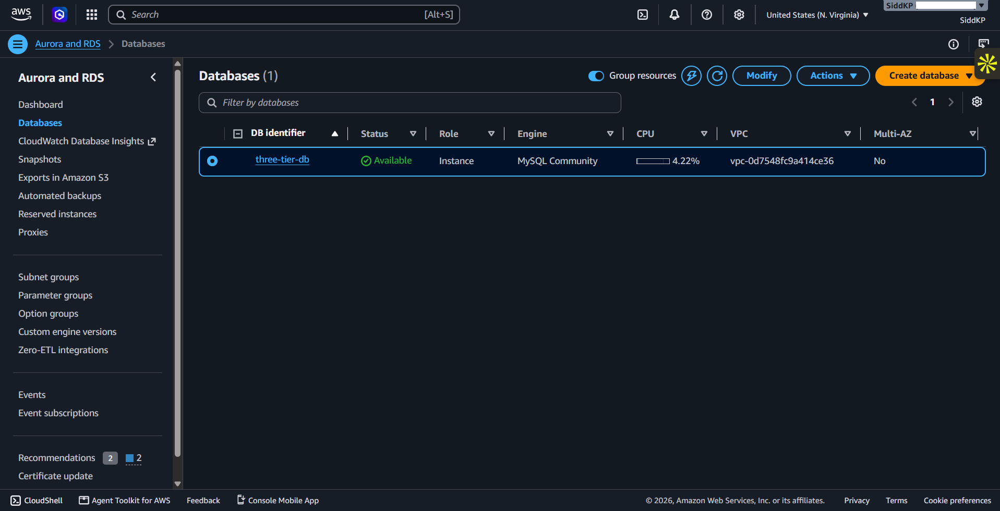

### AWS Secrets Manager
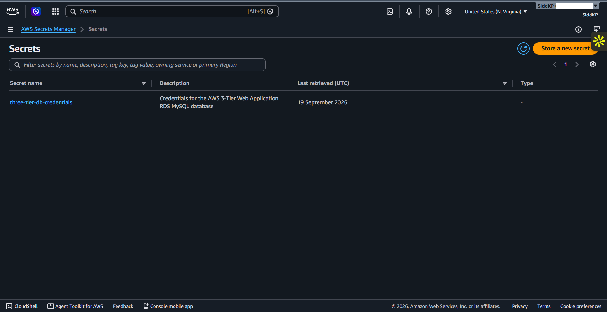

### CloudWatch
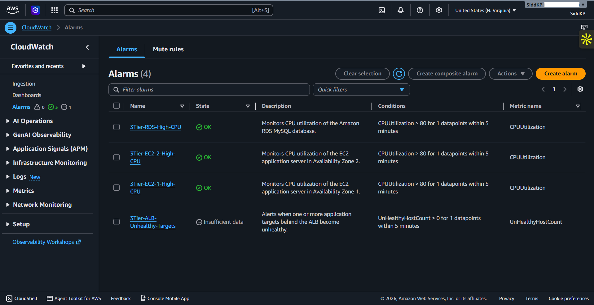

### Running Application
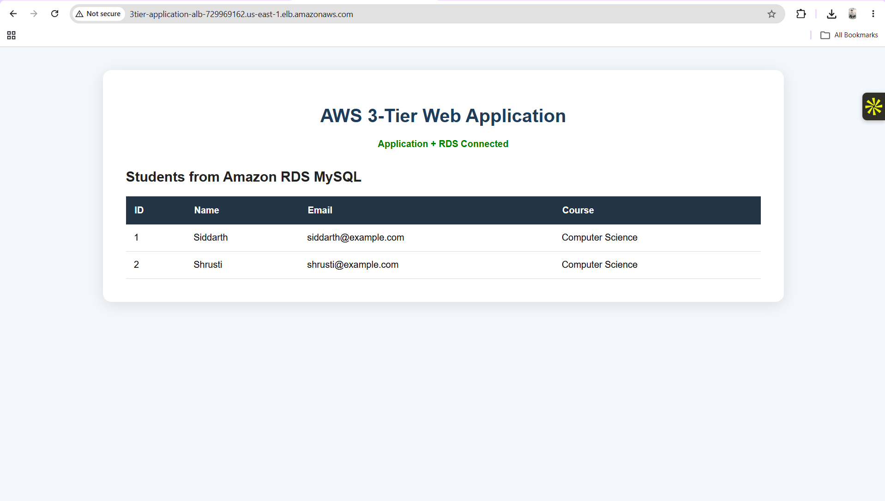

### HA Failover Test
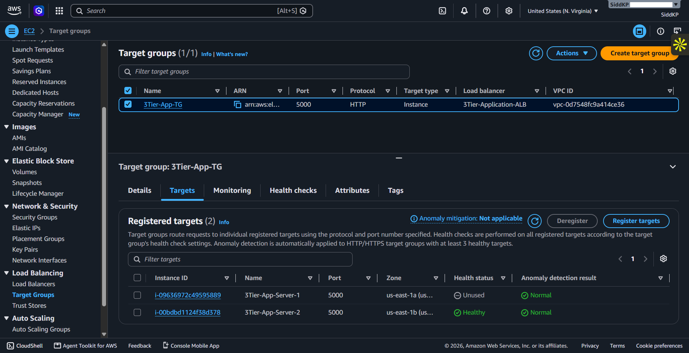

## 🧪 Application Testing

## 🛠️ Technologies Used

## 📂 Repository Structure

## 📚 Documentation

## 💰 Cost Optimization

## 🔒 Security Best Practices

## 🎓 Key Learning Outcomes

## 👨‍💻 Author

Siddarth Pyati
